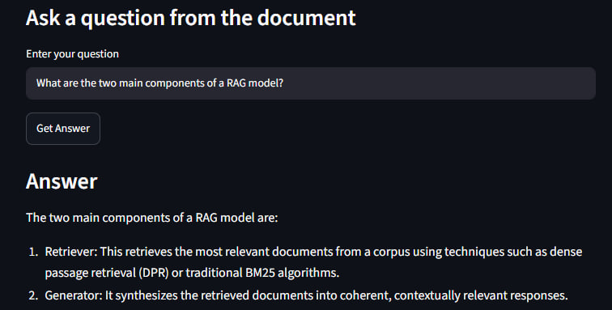

# RAG Document Q&A Chatbot

A simple Retrieval-Augmented Generation (RAG) chatbot that allows users to upload a PDF document and ask questions based on its content.

## Project Purpose

The goal of this project is to build a document-based question-answering system. The chatbot does not train the LLM on the PDF. Instead, it retrieves the most relevant parts of the uploaded document and sends them to the LLM as context to generate an answer.

## Features

* Upload PDF documents
* Extract text from PDFs
* Split document text into smaller chunks
* Convert chunks into embeddings
* Store embeddings in ChromaDB
* Retrieve relevant chunks using semantic search
* Generate answers using an OpenAI LLM
* Display source page numbers for document-grounded answers
* Avoid answering when the information is not found in the uploaded document

## Tech Stack

* Python
* Streamlit
* LangChain
* ChromaDB
* OpenAI Embeddings
* OpenAI LLM
* pypdf
* python-dotenv

## How It Works

1. The user uploads a PDF.
2. The app extracts text from the PDF.
3. The text is split into smaller chunks.
4. Each chunk is converted into an embedding.
5. The embeddings are stored in ChromaDB.
6. When the user asks a question, the question is also converted into an embedding.
7. ChromaDB retrieves the most relevant chunks.
8. The retrieved chunks and user question are sent to the LLM.
9. The LLM generates an answer using only the retrieved context.
10. The app displays the answer and source page numbers.

## Key Learning

This project helped me understand how RAG systems work internally, including document ingestion, chunking, embeddings, vector databases, semantic search, retrieval, prompt construction, and LLM-based answer generation.

## How to Run Locally

1. Clone the repository:

```bash
git clone https://github.com/harsha32002/rag-document-chatbot.git
cd rag-document-chatbot
```

2. Create and activate a virtual environment:

```bash
python -m venv .venv
.venv\Scripts\activate
```

3. Install dependencies:

```bash
pip install -r requirements.txt
```

4. Create a `.env` file and add your OpenAI API key:

```env
OPENAI_API_KEY=your_openai_api_key_here
```

5. Run the Streamlit app:

```bash
streamlit run app.py
```


## Future Improvements

* Add support for multiple PDFs
* Add chat history
* Improve source citation formatting
* Add support for scanned PDFs using OCR
* Deploy the app online

## Demo Screenshot




